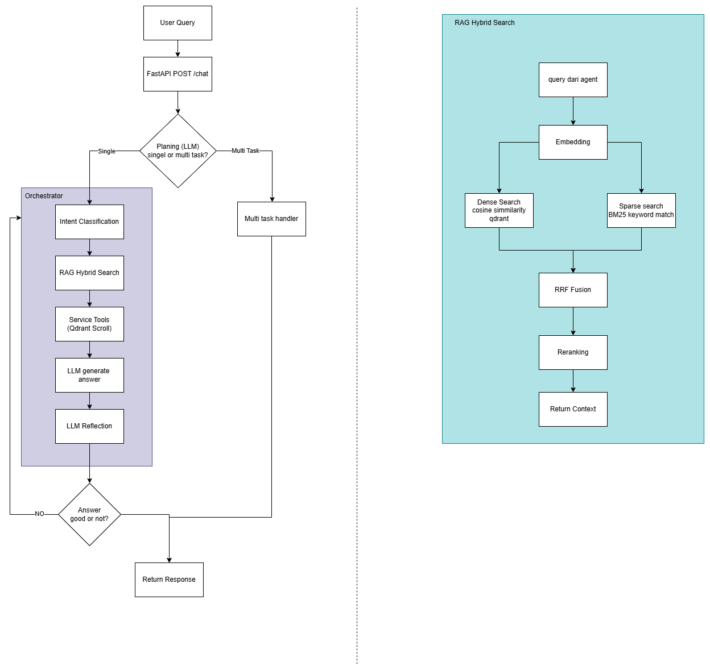

# Agentic RAG Customer Service

Multi-agent system untuk customer service e-commerce. Dibangun sebagai proyek portofolio.

## Demo

- **API**: [Agentic-RAG-Customer-Service-api](https://huggingface.co/spaces/BadBoyBlack/Agentic-RAG-Customer-Service-api)
- **UI**: [Agentic-RAG-Customer-Service-ui](https://huggingface.co/spaces/BadBoyBlack/Agentic-RAG-Customer-Service-ui)

## Overview

Ssstem ini menerima query dari user, mendeteksi apakah query bersifat single atau multi-task,
mengklasifikasi intent ke salah satu dari 30+ kategori, lalu merouting ke agent yang sesuai.
Setiap agent menggunakan ReAct pattern, memanggil tools yang relevan, dan melakukan hybrid
retrieval dari knowledge base masing-masing sebelum generate jawaban.

Ada 5 specialized agent dengan total 17 business tools dan knowledge base sebesar 165 dokumen
synthetic yang mencakup FAQ kebijakan, katalog produk, riwayat tiket, promo/voucher, dan SOP eskalasi.

## Arsitektur



## Tech Stack

| Komponen | Tools |
|---|---|
| Orchestrator | LangGraph |
| LLM | OpenRouter (openai/gpt-oss-120b:free) |
| Embedding | BAAI/bge-m3 |
| Vector Store | Qdrant Cloud |
| Sparse Search | BM25 (rank-bm25) |
| API | FastAPI |
| UI | Chainlit |
| Tracing | LangSmith |

## Features

- **Multi-task planning** — deteksi otomatis apakah query butuh satu atau beberapa agent,
  lalu jalankan secara sequential dengan context passing antar step
- **ReAct pattern** — setiap agent bisa reasoning dan memanggil tools secara iteratif
  sebelum memberikan jawaban akhir
- **Hybrid retrieval** — kombinasi dense search (BGE-M3 cosine similarity) dan sparse search
  (BM25) dengan RRF fusion dan keyword-overlap reranker
- **17 business tools** — stock check, price lookup, voucher validation, order tracking,
  ticket creation, dan lainnya
- **Self-reflection** — orchestrator mendeteksi error pada jawaban agent dan auto-retry
  dengan delay
- **Conversation memory** — history per session (max 5 turn) dikirim ke setiap agent
- **Small talk handler** — greeting, thanks, goodbye, dan out-of-scope ditangani langsung
  tanpa memanggil agent
- **Caching** — in-memory cache dengan TTL 5 menit untuk Qdrant query, speedup 36.000x–145.000x
- **Fallback mechanism** — static fallback data jika Qdrant tidak bisa dijangkau
- **Retry with backoff** — decorator `@with_retry` di semua agent, max 2x dengan exponential backoff

## Struktur Folder
ecommerce-cs-agent/
├── agents/
│   ├── tools/               # 17 business tools
│   ├── orchestrator.py      # LangGraph orchestrator
│   ├── faq_agent.py
│   ├── product_agent.py
│   ├── order_agent.py
│   ├── promo_agent.py
│   └── escalation_agent.py
├── retrieval/
│   ├── dense_retriever.py
│   ├── sparse_retriever.py
│   └── hybrid_retriever.py
├── knowledge_base/ingestion/ # ingestor per collection
├── services/                 # business logic + cache + fallback + retry
├── api/main.py               # FastAPI endpoints
├── tests/                    # 30 unit tests
├── ingest_all.py
└── data/synthetic/           # 165 dokumen knowledge base

## Setup

```bash
git clone https://github.com/BadBoyBlack/ecommerce-cs-agent
cd ecommerce-cs-agent
pip install -r requirements.txt
cp .env.example .env
# isi .env dengan OPENROUTER_API_KEY, QDRANT_URL, QDRANT_API_KEY

# buat payload indexes di Qdrant
python create_indexes.py

# ingest semua knowledge base
python ingest_all.py

# jalankan API
uvicorn api.main:app --reload
```

## API Endpoints

| Method | Endpoint | Deskripsi |
|---|---|---|
| GET | `/health` | Health check |
| POST | `/chat` | Main chat, terima `{query, session_id}` |
| GET | `/products` | List semua produk dari Qdrant |
| GET | `/vouchers` | List voucher aktif dari Qdrant |
| GET | `/products-page` | HTML catalog produk |
| GET | `/vouchers-page` | HTML catalog voucher |
